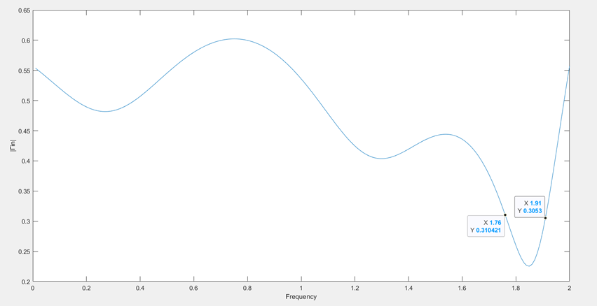

# High-Frequency-Circuits-and-Trasmission-Lines-Projects

This folder contains the analytical study, MATLAB simulations, and optimization strategies for **Part A** of the High-Frequency Devices course (ECE AUTh). The project focuses on transmission line theory, impedance matching, and broadband optimization using evolutionary algorithms.

## 📘 Part A: Transmission Lines & Impedance Matching

### 🔍 Scientific Analysis & Insights

#### 1. Network Characterization (Ex. 1.2)
Analysis of complex distributed networks using S-parameters and Standing Wave Ratio (SWR). The project evaluates how frequency variations (0-4 GHz) affect the reflection coefficient in circuits with mixed lumped and distributed elements.

#### 2. Stepped-Impedance Microstrip Filter (Ex. 1.2c)
Design and simulation of a 5-section Low-Pass Filter (LPF) utilizing alternating high ($Z_H$) and low ($Z_L$) characteristic impedances. The results validate the stopband rejection levels and the accuracy of the physical length calculations.

#### 3. Impedance Matching Topologies (Ex. 1.3)
Comparative study of three matching solutions for a generator ($Z_g = 50-40j$) and load ($Z_L = 10+15j$) at 1 GHz:
* **Case A:** Shunt capacitor at input ($C=3.09\text{ pF}, l=0.0111\text{ m}$).
* **Case B:** Shunt capacitor at load ($C=4.77\text{ pF}, l=0.03\text{ m}$).
* **Case C:** Series capacitor at input ($C=2.89\text{ pF}, l=0.0414\text{ m}$).

**Finding:** All topologies achieve maximum power transfer at the design frequency, but exhibit different frequency stability (bandwidth) characteristics.

#### 4. Broadband Optimization via JAYA Algorithm (Ex. 1.4)
The core of the project involves the optimization of a **Triple-Stub Tuner** to achieve broadband matching using the **JAYA Algorithm** (Population: 1000, Iterations: 3000).

**Key Performance Results:**
* **Scenario 1 ($Z_L = 120 + 60j$, Range $0.5-1.5 f_0$):**
    * Initial mean $|\Gamma_{in}| = 0.3870$.
    * Optimized vector: $p = [0.2334, 0.0815, 0.1487, 0.4784, 0.1167, 0.0500]$.
* **Scenario 2 ($Z_L = 120 + 60j$, Range $0.01-2.0 f_0$):**
    * Optimized vector: $p = [0.2209, 0.1125, 0.1246, 0.085, 0.0823, 0.0500]$.
    * Mean $|\Gamma_{in}| = 0.4702$. Effective matching achieved between **1.54 - 1.97 GHz**.
* **Scenario 3 (Load Sensitivity):**
    * For **$Z_L = 20 + j30$**: Mean $|\Gamma_{in}| = 0.4747$. Narrow match window (1.76-1.91 GHz).
    * For **$Z_L = 180 - j20$**: Mean $|\Gamma_{in}| = 0.7254$. Physical limitation reached; broadband matching was not feasible for this specific high-impedance load over the large bandwidth.

### 💻 MATLAB Source Code Mapping

| File | Context | Description |
| :--- | :--- | :--- |
| `res1.m` | Ex. 1.2a | Frequency response and abs(Gamma) plots. |
| `res2.m` | Ex. 1.2b | SWR and Return Loss analysis. |
| `res3.m` | Ex. 1.2c | Microstrip Filter simulation. |
| `res4a.m` | Ex. 1.3γ | Power transfer (Shunt Matching). |
| `res4b.m` | Ex. 1.3γ | Power transfer (Series Matching). |
| `res6.m` | Ex. 1.4 | Objective function for JAYA optimization. |
| `CalcZin.m`| Utility | Recursive impedance transformation function. |

> **Note:** To reproduce specific results from Scenarios 2 & 3, the `normf` and `zl` variables inside `res6.m` must be adjusted to match the parameters described in the technical report.

---

### 📂 Technical Documentation
Detailed mathematical derivations, Smith Charts, and optimization convergence plots are available in the technical report:
👉 [Report_A.pdf](Part_A/docs/Report_A.pdf)

## 📘 Part B: Electromagnetic Fields & Antennas

### 🔍 Scientific Analysis & Insights

#### 1. Dielectric Property Characterization (Ex. 2.1)
Determination of the relative permittivity ($\epsilon_r$) and loss tangent ($\tan\delta$) of a material using a rectangular waveguide (TE10 mode) at $10\text{ GHz}$.
* **Methodology:** Input impedance ($Z_{in}$) was measured for two samples with thicknesses $d$ and $2d$. 
* **Implementation:** The transcendental equation $(\tanh(\gamma d))^2 = k$ was solved using symbolic math in MATLAB to extract the complex propagation constant $\gamma$.
* **Results:** The material was characterized with $\epsilon_r = 4.46$ and $\tan\delta = 0.2171$, identifying it as a lossy dielectric consistent with standard FR4 properties.

#### 2. Antenna Array Synthesis (Ex. 2.2)
Design and analysis of an 8-element linear array of $\lambda/2$ dipoles and a 4-element rectangular array.
* **Array Factor Analysis:** Evaluated radiation patterns for element spacings of $d = \lambda/4, \lambda/2,$ and $3\lambda/4$.
* **Numerical Directivity:** Calculated $D_{max}$ via numerical integration (Riemann sums) over the $(\theta, \phi)$ power density grid.
* **Geometric Optimization:** For the rectangular array, symbolic solvers identified coordinates $(h_x, h_y)$ to synthesize specific radiation nulls and peaks.
* **Visualization:** 3D radiation solids were generated using the MATLAB Antenna Array Designer to verify beamforming and grating lobe emergence.

#### 3. Double Stub Impedance Matching (Ex. 2.3)
Broadband matching of a complex load $Z_L = 20 - j30 \Omega$ at $5\text{ GHz}$ using a double-stub tuner with fixed spacing $d = \lambda/8$.
* **Optimization:** Used `fsolve` to find the two physical solutions for stub lengths.
* **Performance:** Frequency sweeps ($0-10\text{ GHz}$) confirmed that the solution with longer stub lengths provides a significantly wider bandwidth ($SWR \leq 2$).
* **Constraint Analysis:** Analyzed the "Forbidden Regions" on the Smith Chart where matching is mathematically impossible for fixed-distance stubs.

#### 4. Microstrip Resonator & Critical Coupling (Ex. 2.4)
Design of a $\lambda/2$ microstrip resonator on an FR4 substrate ($h=1.6\text{mm}, \epsilon_r=4.4$) for $2.5\text{ GHz}$ operation.
* **Geometric Design:** * Calculated microstrip width $W = 3.06\text{mm}$ and effective permittivity $\epsilon_{r,eff} = 3.33$.
    * Determined physical length $l = 32.88\text{mm}$ for resonance.
* **Coupling Optimization:** * Solved for the gap capacitance ($C = 0.348\text{ pF}$) required for critical coupling to the $50 \Omega$ feedline.
    * Accounted for the frequency shift caused by the coupling gap, iteratively re-scaling the resonator length ($l_{new} = 30.27\text{mm}$) to maintain the $2.5\text{ GHz}$ target.
* **Analytical Validation:** Results were cross-verified using Smith Chart approximations and iterative numerical solvers (`fsolve`).

### 💻 MATLAB Source Code Mapping

| File | Exercise | Description |
| :--- | :--- | :--- |
| `solve_dielectric_properties.m` | 2.1 | Symbolic solver for $\epsilon_r$ and $\tan\delta$. |
| `antenna.m` | 2.2a | 2D Polar radiation patterns for linear arrays. |
| `directivity.m` | 2.2c | Numerical integration for array directivity. |
| `antenna_d.m` | 2.2d | Rectangular array geometry & pattern synthesis. |
| `double_stub_tuning.m` | 2.3 | Double-stub matching and bandwidth analysis. |

---

### 📂 Technical Documentation
Complete mathematical derivations, handwritten solution sets, and 3D simulation exports are located in the documentation folder:
👉 [Report_B.pdf](Part_B/docs/Report_B.pdf)
